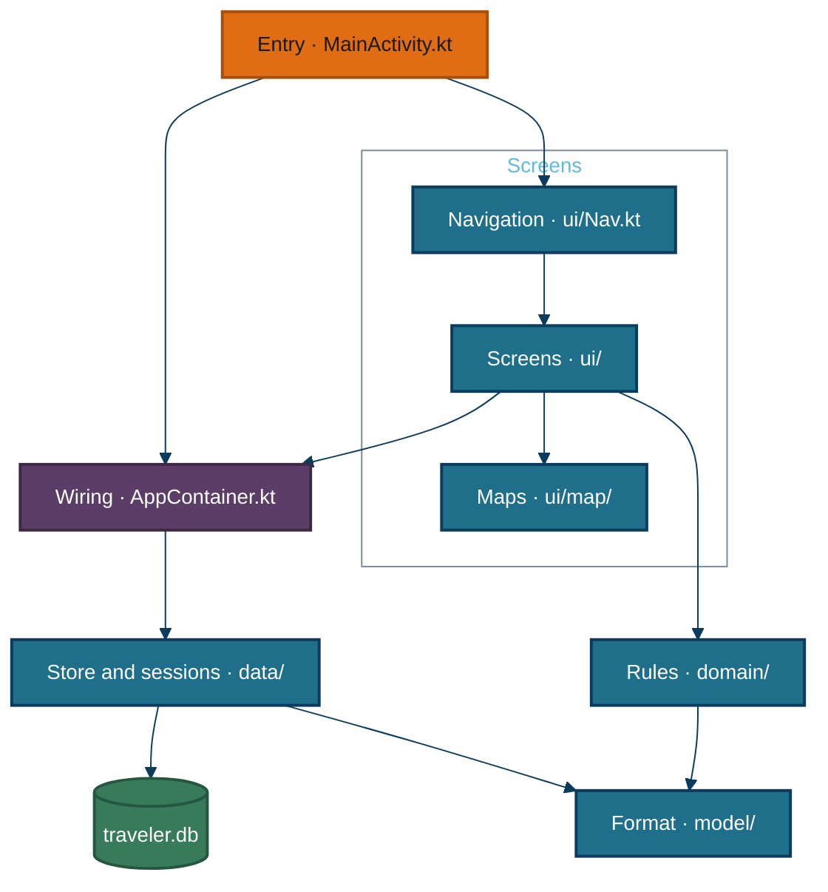
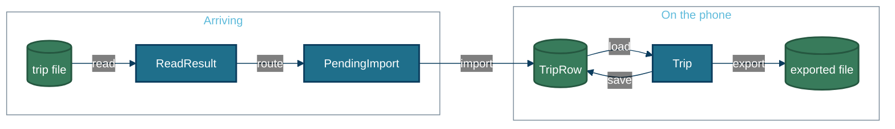

# Traveler — the maps

Traveler is an Android app that keeps a trip plan on your phone and works offline. An AI assistant writes the plan as one JSON file. The app imports it, lets you rearrange days and record bookings, and sends your edited plan back to the assistant for a revision, which it then merges with what you changed.

This page is the map. The root [README](../../README.md) is the landing page and the manual, so this folder has no README of its own. [ARCHITECTURE.md](../ARCHITECTURE.md) is the hand-written design account, and [trip-format.md](../trip-format.md) is the format for people. These pages describe only what exists.

App paths are written relative to the one code root, `app/src/main/kotlin/dev/tlong/traveler/`. Everything else is relative to the repository root.

## At a glance

The dashed boxes are the two places code runs: the app on the phone, and the build tools on a developer's machine. Dashed arrows cross from the phone to something it does not control.

<picture>
  <source media="(prefers-color-scheme: dark)" srcset="diagrams/overview-dark.svg">
  
</picture>

| Container | Paths | What it does |
|---|---|---|
| Android app | `app/` | Receives a file you open or share, reads and checks it, shows a preview, imports it or merges it with your edits, saves every edit at once with undo, plans days and slots, tracks bookings, draws the trip and stay maps, exports the plan and backs up all trips |
| Trip format | `schema/` | Defines the trip file as JSON Schema, holds the example trips the app ships, and holds the broken files both readers are tested against |
| Validator | `tools/validate_trip.py` | Loads the schema, checks structure, then cross-checks ids, dates and time zones, optionally requires stars, prices and priorities, prints OK or each ERROR and WARNING, and exits 1 on any error |
| Skill builder | `tools/make_skill.py`, `integrations/skill/` | Clears `build/skill/`, joins each preamble with its prompt into two skills, zips each, wraps both in a plugin, and writes flat ChatGPT Project files |
| Fixture builder | `tools/make_fixtures.py` | Reads the hand-written Iguazú trip and writes its second revision and a 14-stay synthetic trip, byte-identical on every run |
| Basemap builder | `tools/make_basemap.py` | Downloads Natural Earth country outlines once, rounds them to 0.02°, and writes the offline country map the app draws first |
| Emulator driver | `tools/emu/ui.py` | Dumps the screen's element tree through adb, taps by visible text, drags, and takes screenshots |

**The Makefile declares the first five, not the last two.** `make debug`, `install` and `test` build the app; `validate` and `tools-test` run the validator; `skill` and `fixtures` run their builders. The basemap and emulator scripts have no target; they are run by hand and appear here because each has its own entry point.

**The assistant is drawn outside the system.** Nothing in the repository calls it: you carry the file to it and back. The prompts and the skill are what the repository gives it.

<details>
<summary>Component view: the Android app (8 packages)</summary>



| Package | Path | Holds |
|---|---|---|
| Entry | `MainActivity.kt`, `App.kt` | The one activity, and the application that builds the container and starts the purge |
| Wiring | `AppContainer.kt` | One database, one store, one session per open trip, the pending import |
| Store and sessions | `data/` | Room tables, the store, the open-trip session, the import router |
| Rules | `domain/` | Dates and time zones, edits, placement checks, bookings, merge, export, map areas |
| Format | `model/` | The trip types, the lenient JSON reader and writer, plain-language errors |
| Screens | `ui/` | Trips, import preview, overview, stay, day, bookings, history, settings |
| Maps | `ui/map/` | The trip map, the stay terrain map, saved offline maps and trip pictures |

Each package's internals are drawn in [architecture.md](./architecture.md).

</details>

## How data moves



<details>
<summary>What the data looks like at each step</summary>

| Step | Type | Defined at | Real example |
|---|---|---|---|
| File | trip JSON | `schema/trip.schema.json` | `schema/examples/demo.trip.json` |
| Read | `ReadResult` | `model/TripReader.kt:18` | a trip plus lists of errors and warnings |
| Routed | `PendingImport` | `data/ImportRouter.kt:13` | new trip, already imported, revision with a merge plan, backup, or invalid |
| Stored | `TripRow` | `data/Database.kt:27` | the last import and the current plan, both as JSON text |
| Edited | `Trip` | `model/Trip.kt:20` | the plan in memory, one per open trip |
| Exported | trip JSON plus `exportedFrom` | `domain/Export.kt:18` | the same format, carrying how far the plan has moved |

Full shapes and the storage diagram are in [data.md](./data.md).

</details>

## Using it

Ask an assistant for a trip. In the app, **Settings → Copy instructions** copies the prompt; paste it into Claude or ChatGPT with where and when you are going. Save or share the file it writes, and open it with Traveler. A preview lists the stays and any problems before anything is saved.

```bash
make doctor      # check JDK 17 and the Android SDK
make check       # validator tests, example checks, app tests
make install     # put the app on a plugged-in phone or the emulator
```

**Planning a day.** Open a stay or a day and drag suggestions between morning, afternoon and evening, or pick another day. The app warns when something clashes with a booking, a flight, your work hours or opening hours. Everything saves as you go, and undo reaches back fifty steps.

**Getting a revision.** Export the trip from the overview's share button, give it to the assistant with what you want changed, and open its reply. The app merges it with your edits: your notes, moves and done marks stay, and where you and the assistant changed the same thing, you choose. The version before is kept in History.

The full traces are in [workflows.md](./workflows.md).

## Configuring it

The app itself has no settings that change behaviour; everything below is for building it.

| Knob | Where | Default | What changes |
|---|---|---|---|
| Android SDK location | `sdk.dir` in `local.properties` | none; `make doctor` says how to set it | Where Gradle and the Makefile find the SDK, adb and the emulator |
| Release signing | `keystore.properties` | absent | Present: the release APK is signed. Absent: it builds unsigned |
| JDK | `JAVA_HOME` | the JDK 17 that `java_home -v 17` finds | Which JDK the Makefile hands Gradle |

Every knob, and the constants that only look like knobs, are in [configuration.md](./configuration.md).

## Where things live

```text
app/            the Android app: Kotlin sources, tests, Room schema
docs/           the hand-written design account, build guide and format; these maps
integrations/   preambles and READMEs for the assistant skill and ChatGPT
prompts/        the two assistant prompts; also shipped inside the app
schema/         the JSON Schema, example trips and broken-file fixtures
tools/          validator, skill, fixture and basemap builders, emulator driver
Makefile        every build, test and device command
```

## Attribution

The stay maps draw OpenStreetMap data served by OpenFreeMap, with Natural Earth relief; the app shows the credit in the map's ⓘ button. The offline country outlines are Natural Earth, public domain. Details are in [sources.md](./sources.md).

## Deeper

- [README](../../README.md): what the app is and the loop
- [architecture.md](./architecture.md): each package's internals
- [data.md](./data.md): the file, the tables, the invariants
- [workflows.md](./workflows.md): import, edit, revise, export, save maps
- [configuration.md](./configuration.md): every knob and fixed constant
- [sources.md](./sources.md): everything off the phone
- [ARCHITECTURE.md](../ARCHITECTURE.md), [BUILD.md](../BUILD.md), [trip-format.md](../trip-format.md): the hand-written documents

*Generated from 72c887b on 2026-10-05.*
