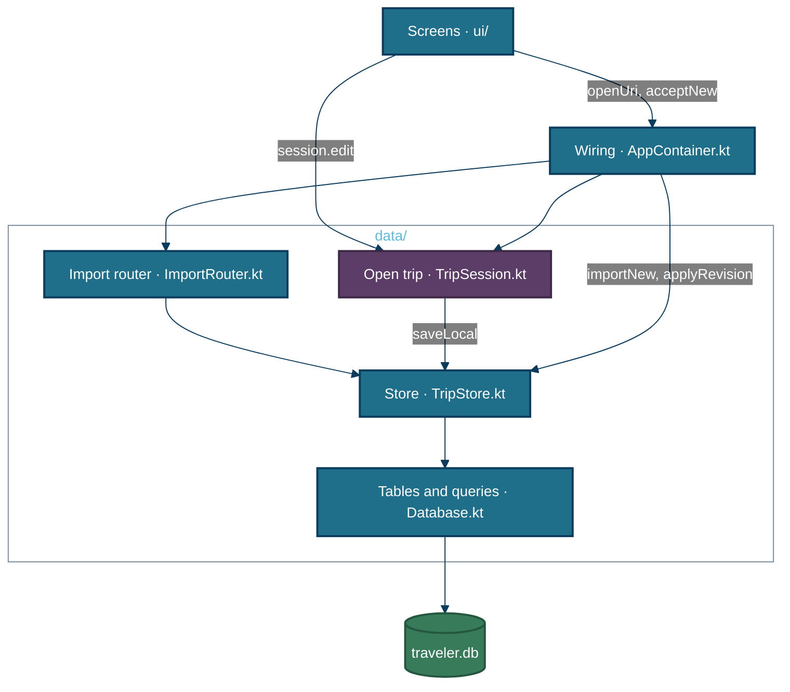
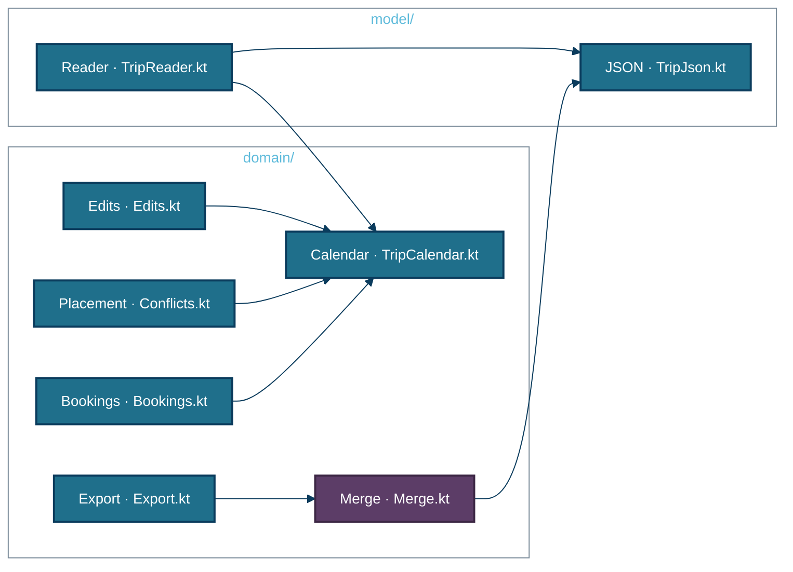
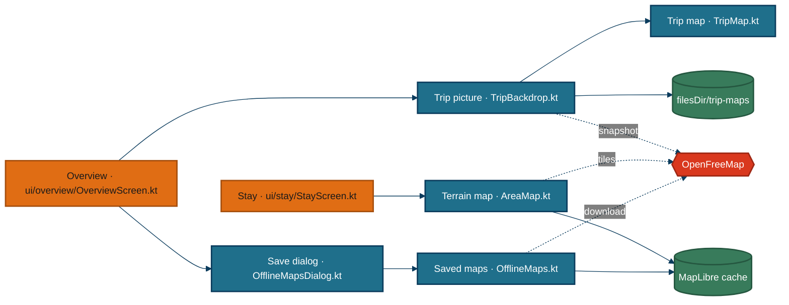

# Architecture — component views

[OVERVIEW.md](./OVERVIEW.md) already folds the app's eight packages into one view. This page draws the three with internal structure worth a picture: the store and sessions in `data/`, the import and merge path through `domain/`, and the maps in `ui/map/`. The screens in `ui/` are one Compose screen per route with no structure between them beyond `ui/Nav.kt`; `model/` is the format's types plus one reader and one writer. The repository tools are single scripts and have no components.

Why it is built this way is in the hand-written [ARCHITECTURE.md](../ARCHITECTURE.md); this page shows what exists.

## Store and sessions — `data/`

| Component | Path | What it does |
|---|---|---|
| Wiring | `AppContainer.kt` | Opens the database, builds the store and router, hands out one session per trip id, holds the pending import, accepts a new trip, a revision, an undelete or a backup, and purges expired trips and their saved maps at start |
| Import router | `data/ImportRouter.kt` | Spots a backup by its format field, reads the trip, looks it up by id, compares content hashes, and returns new, already imported, revision with a merge plan, backup, or invalid |
| Open trip | `data/TripSession.kt` | Applies an edit, pushes the old plan on an undo stack of 50, shows the new plan, queues the write, and reports saving, saved or failed |
| Store | `data/TripStore.kt` | Inserts a new trip, overwrites the plan, snapshots before any replacement, keeps 20 snapshots, archives, soft-deletes, purges after 30 days, writes and reads backups |
| Tables | `data/Database.kt` | Two Room tables, `trips` and `snapshots`, and the queries on them |

**Every edit is one whole-document write.** `TripSession.edit` (`data/TripSession.kt:60`) builds a new `Trip` and sends it down a conflated channel; the single writer loop (`data/TripSession.kt:48`) writes only the newest plan, and the save indicator turns to "saved" only when the plan on screen is the one that landed.

**Screens never write the database.** They call `TripSession.edit` with a function from `domain/Edits.kt`, or a method on `AppContainer.kt`. That is the only way a change records its `userEdited` mark and its undo step.

**Anything that replaces a trip snapshots it first.** A revision import, a snapshot restore and a backup restore each call the private `snapshot` (`data/TripStore.kt:97`) before overwriting, which is what History lists and restores.

## Import and merge — `domain/`

| Component | Path | What it does |
|---|---|---|
| Reader | `model/TripReader.kt` | Pulls the JSON out of pasted text, refuses a newer format version, decodes, lists unknown fields as warnings, then runs the same cross-checks as the validator |
| JSON | `model/TripJson.kt` | Reads leniently, writes pretty or compact, converts to and from a JSON tree, finds unknown fields, turns serializer errors into plain sentences |
| Calendar | `domain/TripCalendar.kt` | Lists the trip's dates, finds the stay for a date, tells home-airport stays apart, normalizes days and plans, and converts work hours between zones |
| Merge | `domain/Merge.kt` | Compares the last import, your plan and the new file field by field, lists changes, conflicts, removals and restorables with defaults, then applies your decisions |
| Edits | `domain/Edits.kt` | Every change you can make: place, move, reorder, mark done, add entries and bookings, mark lodging or transfers booked, rename; each records `userEdited` |
| Placement | `domain/Conflicts.kt` | Builds the day's busy times from bookings, transfers and work hours, then reports what blocks or warns for a slot |
| Bookings | `domain/Bookings.kt` | Collects lodging, ticketed transfers, activities needing a booking and booking records into one list, with priorities and per-currency totals |
| Export | `domain/Export.kt` | Compacts the plan, stamps `exportedFrom`, names the file, and hashes content to spot the same file twice |

**The merge is three-way and by id.** `Merge.plan` (`domain/Merge.kt:115`) takes the last import as the common ancestor, so a field changed only in the file is taken, a field changed only by you is kept, and a field changed on both sides becomes a conflict that defaults to keeping yours. Days are matched by date, everything else by `id`.

**The app's own fields never come from a file.** `origin`, `userEdited` and `userNote` (`model/Trip.kt:198`) always keep the local value in a merge, which is how your entries and notes survive a round trip through an assistant.

**`domain/` and `model/` have no Android imports.** Their tests run as plain JVM tests; only the store and the screens need Robolectric.

## Maps — `ui/map/`

| Component | Path | What it does |
|---|---|---|
| Trip picture | `ui/map/TripBackdrop.kt` | Looks for a saved picture for this trip, size and set of stays; if none and online, renders one with MapLibre's snapshotter, shows it, and saves it as WebP |
| Trip map | `ui/map/TripMap.kt` | Projects stays to Web Mercator, draws the picture or the offline country outlines, numbered stay markers clustered on screen, dashed transfer arcs, and a scale bar |
| Terrain map | `ui/map/AreaMap.kt` | Starts MapLibre with a 100 MB tile cache, builds the terrain-only style, fits the pins, draws numbered pin bitmaps, re-clusters them when the camera settles, caps zoom at 13 |
| Saved maps | `ui/map/OfflineMaps.kt` | Deletes the trip's old regions, stores the style under a placeholder URL, creates one region per stay, downloads them one by one with progress, sizes them, prunes regions of deleted trips |
| Save dialog | `ui/map/OfflineMapsDialog.kt` | Shows what is saved and its size, warns on a metered or missing connection, and offers save, update, stop or remove |

**The trip map never needs the network.** Without a saved picture, `ui/map/TripMap.kt` draws `app/src/main/assets/basemap/countries.txt`; the picture is taken once while online and reused until the stays move or the size changes.

**The terrain map draws no streets and no text.** The style from `terrainStyle` (`ui/map/AreaMap.kt:66`) has land, built-up areas, parks, sand, rivers, water and borders only, so it needs no font downloads and stays small enough to save a city in a few megabytes.

## Conventions that hold across the app

- **One open session per trip.** `AppContainer.session` (`AppContainer.kt:37`) caches sessions by id, so two screens on the same trip share one undo stack and one save queue.
- **A trip is a document, not rows.** Everything below the session works on whole `Trip` values; the table columns other than the two JSON documents exist only so the trip list can draw without parsing.
- **Text the format allows to be rich is rendered by one function.** `rich` in `ui/common/Common.kt` handles the bold and link markdown the format permits, everywhere.
- **The example trips and prompts ship inside the APK.** `app/build.gradle.kts` adds `schema/examples` and `prompts` as asset folders, so "Try the example trip", the demo and "Copy instructions" work offline.

*Generated from 72c887b on 2026-10-05.*
