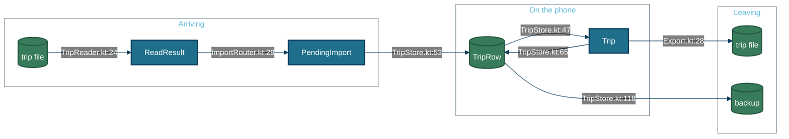
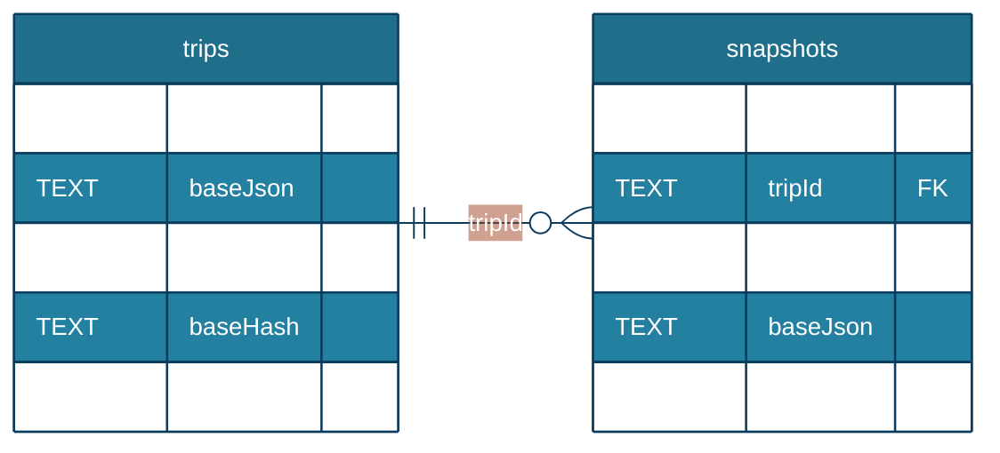

# Data

Every type here is defined in `model/Trip.kt` or `data/`, and every example comes from `schema/examples/demo.trip.json`. That file is the hand-maintained demo trip, so its examples are **written to shape**, not captured from a run; it holds no real bookings or people. The format for people is [trip-format.md](../trip-format.md).

## The flow



The same file text also goes through `tools/validate_trip.py`, which applies the same rules outside the app.

## Payload cards

### `Trip` — the whole plan, as the assistant writes it and the app stores it

Defined at `model/Trip.kt:20`. Written by an assistant, by `Export.tripFile` (`domain/Export.kt:18`), and by every function in `domain/Edits.kt`.

| Field | Type | Notes |
|---|---|---|
| `format`, `formatVersion` | string, int | `traveler-trip` and 1; always written. A higher version is refused with a plain message |
| `id` | string | Stable across revisions; the merge and the duplicate check depend on it |
| `revision` | int | The assistant raises it on each new version; export keeps the base revision |
| `title`, `startDate`, `endDate` | string | ISO dates |
| `travelers` | int | How many people; per-person prices are multiplied by it. Absent means one |
| `stays`, `transfers`, `activities`, `commitments`, `days` | lists | The cards below |
| `links`, `notes`, `warnings`, `tripMap` | various | Trip-level extras |
| `exportedFrom` | `ExportInfo` | Present only in an exported file |
| `userEdited` | list of strings | Trip fields you changed |

<details>
<summary>Example: the demo trip's top level, lists elided</summary>

From `schema/examples/demo.trip.json`, **written to shape**.

```json
{
  "format": "traveler-trip",
  "formatVersion": 1,
  "id": "demo-buenos-aires-madryn",
  "revision": 1,
  "generatedBy": "Traveler demo",
  "title": "Demo: Buenos Aires + Puerto Madryn",
  "startDate": "2027-10-17",
  "endDate": "2027-10-25",
  "stays": "[5 …]",
  "transfers": "[4 …]",
  "activities": "[24 …]",
  "commitments": "[2 …]",
  "days": "[9 …]"
}
```

</details>

### `Stay` — one base, with at most one lodging

Defined at `model/Trip.kt:72`, lodging at `model/Trip.kt:92`.

| Field | Type | Notes |
|---|---|---|
| `id`, `name` | string | |
| `arrive`, `depart` | date | A stay with zero nights at the very start or end is the home airport, and is left off maps and lists |
| `timezone` | IANA zone | Days, opening hours and work hours are local to it |
| `place` | `Place` | Query, coordinates, address or place id |
| `lodging` | `Lodging` | Name, status (`booked`, `tentative`, `undecided`), check-in and out, reference, price (usually a nightly rate), booking advice |
| `workRhythm` | `WorkRhythm` | Days and hours, optionally in another zone, converted per date |
| `mapUrl` | string | An optional link you add to a custom map |

<details>
<summary>Example: the Palermo stay</summary>

From `schema/examples/demo.trip.json`, **written to shape**.

```json
{
  "id": "palermo",
  "name": "Buenos Aires · Palermo",
  "region": "CABA, Argentina",
  "place": { "query": "Palermo, Buenos Aires", "lat": -34.588, "lng": -58.429 },
  "arrive": "2027-10-18",
  "depart": "2027-10-20",
  "timezone": "America/Argentina/Buenos_Aires",
  "lodging": {
    "name": "Palermo Soho Loft",
    "status": "booked",
    "checkIn": "15:00",
    "checkOut": "11:00",
    "ref": "HMQ2X9",
    "price": { "amount": 190, "currency": "USD", "note": "2 nights; about ARS 230,000" }
  },
  "workRhythm": {
    "days": ["mon", "tue"],
    "start": "07:00",
    "end": "11:00",
    "timezone": "America/Los_Angeles"
  }
}
```

</details>

### `Activity` — a suggestion, or your own entry

Defined at `model/Trip.kt:173`.

| Field | Type | Notes |
|---|---|---|
| `id`, `stayId`, `name` | string | `stayId` must name a stay |
| `stars` | 1–3 | How strongly the plan recommends it |
| `place`, `duration`, `availability`, `hours` | various | What the placement checks read |
| `booking` | `Booking` | Status, priority 1–3, price, link and how to book |
| `origin` | string | `user` for an entry you added |
| `userEdited`, `userNote` | list, string | Your changes and your note; never taken from a file |

<details>
<summary>Example: the Teatro Colón tour, which needs booking</summary>

From `schema/examples/demo.trip.json`, **written to shape**, trimmed to the fields above.

```json
{
  "id": "teatro-colon",
  "stayId": "san-telmo",
  "name": "Teatro Colón guided tour",
  "tag": "🎭",
  "stars": 3,
  "place": { "query": "Teatro Colón, Cerrito 628, Buenos Aires", "lat": -34.6011, "lng": -58.3832 },
  "duration": { "minutes": 60 },
  "availability": [{ "days": ["mon", "tue", "wed", "thu", "fri", "sat", "sun"], "start": "09:00", "end": "17:00" }],
  "booking": {
    "status": "needed",
    "priority": 1,
    "url": "https://teatrocolon.org.ar/en/guided-tours",
    "price": { "amount": 30, "currency": "USD", "note": "Per person; about ARS 35,000" },
    "how": "Buy online for a morning English tour; they sell out days ahead."
  }
}
```

</details>

### `Day` and `PlanItem` — what is planned when

Defined at `model/Trip.kt:257` and `model/Trip.kt:268`.

| Field | Type | Notes |
|---|---|---|
| `date`, `stayId` | string | Days are matched by date in a merge |
| `kind` | string | `plan`, `travel`, `rest` and the like |
| `plan` | list of `PlanItem` | Each names an activity, a slot (`morning`, `afternoon`, `evening`, `allday`), an optional time and a status (`proposed`, `done`, `skipped`) |

<details>
<summary>Example: the first full day in Palermo</summary>

From `schema/examples/demo.trip.json`, **written to shape**.

```json
{
  "date": "2027-10-18",
  "stayId": "palermo",
  "kind": "plan",
  "title": "Arrive; Palermo parks",
  "plan": [
    { "activityId": "bosques-palermo", "slot": "afternoon", "status": "done" },
    { "activityId": "palermo-soho", "slot": "evening", "status": "done" },
    { "activityId": "don-julio", "slot": "evening", "time": "21:00" }
  ]
}
```

</details>

### `Commitment` — a fixed-time booking

Defined at `model/Trip.kt:233`. Written by the assistant, or by `Edits.addBooking` when you add one.

<details>
<summary>Example: the whale-watching boat you booked</summary>

From `schema/examples/demo.trip.json`, **written to shape**.

```json
{
  "id": "whales-booked",
  "title": "Whale-watching boat",
  "date": "2027-10-23",
  "start": "09:30",
  "end": "11:00",
  "kind": "booking",
  "booked": true,
  "stayId": "madryn",
  "activityId": "valdes-whales",
  "ref": "HS-20931",
  "price": { "amount": 190, "currency": "USD", "note": "Two people" },
  "origin": "user"
}
```

</details>

### `ExportInfo` — how far an exported plan has moved

Defined at `model/Trip.kt:277`. Written by `Export.tripFile` (`domain/Export.kt:18`).

**No fixture found.** No committed file carries an `exportedFrom` block.

| Field | Type | Notes |
|---|---|---|
| `app` | string | `Traveler` |
| `exportedAt` | ISO instant | To the second |
| `basedOnRevision` | int | The revision of the last import |
| `localChanges` | int | How many entities you changed since then |

### `BackupFile` — every trip, both documents

Defined at `data/TripStore.kt:26`. Written by `TripStore.backupText` (`data/TripStore.kt:118`).

**No fixture found.** A backup holds `format` (`traveler-backup`), `formatVersion` 1, `createdAt`, and `trips`: for each live trip, the last import, your current plan, whether it is archived, and when it was last updated.

### `Price` — what something costs, and what the amount is for

Defined at `model/Trip.kt:114`. Multiplied out by `Price.total` in `domain/Bookings.kt`.

| Field | Type | Notes |
|---|---|---|
| `amount`, `max` | number | One figure, or a range |
| `currency` | ISO code | Assistants write USD, with the local price in `note` |
| `unit` | `total`, `night`, `person` | The whole item (the default), one night of a stay (lodging only), or one traveler |
| `note` | string | |

**Every total the app shows is multiplied out.** The Bookings list, its estimate and the lodging card all show a nightly rate times the stay's nights and a per-person price times `travelers`; the rate itself is shown beside the total only when the multiplication changed it.

## Storage



Both tables are in `traveler.db`, defined at `data/Database.kt:27` and `data/Database.kt:58`. The other `trips` columns (title, dates, revision, archived, export time and hash) exist so the trip list can draw without parsing the documents.

| Store | Written by | Read by |
|---|---|---|
| `trips` | `TripStore` on import, every edit, revision, restore, archive, delete | the trip list, every session, the import router, backup |
| `snapshots` | `TripStore` before any replacement | History |
| `filesDir/trip-maps` | `TripBackdrops.save` | the trip map |
| `filesDir/images` | `cachedBitmap` in `ui/common/Files.kt` | the overview's trip image |
| MapLibre's database | MapLibre: tiles you viewed, and saved regions | the terrain map, offline |
| `cacheDir/exports` | `shareTextFile` in `ui/common/Files.kt` | the share sheet |

### Migrations

| Version | Function | What it does |
|---|---|---|
| 1 | none | The only schema, exported to `app/schemas/dev.tlong.traveler.data.TravelerDatabase/1.json`. Format changes live inside the JSON documents, so the tables have not needed a migration |

## Invariants

| Invariant | Where | Why it matters |
|---|---|---|
| "Saved" shows only when the plan on screen is the one on disk | `data/TripSession.kt:51` | Closing the app never loses an edit the screen claimed was saved |
| Only the newest pending plan is written | `data/TripSession.kt:44` | A burst of edits costs one write, never an out-of-order one |
| A trip is snapshotted before a revision, restore or backup replaces it | `data/TripStore.kt:72` | Every import can be undone from History |
| At most 20 snapshots are kept per trip | `data/TripStore.kt:146` | History stays bounded |
| A deleted trip is purged 30 days after deletion, with its snapshots and saved maps | `data/TripStore.kt:113`, `AppContainer.kt:100` | Recently deleted is a real undo, and nothing lingers after it |
| Opening the same content twice makes no duplicate | `data/ImportRouter.kt:41` | Sharing a file twice is harmless |
| `origin`, `userEdited` and `userNote` always keep the phone's value in a merge | `model/Trip.kt:207` | Your entries and notes survive a revision |
| Content identity ignores `exportedFrom` | `domain/Export.kt:37` | An exported file reopened is recognised as the same trip |

*Generated from 72c887b on 2026-10-05.*
