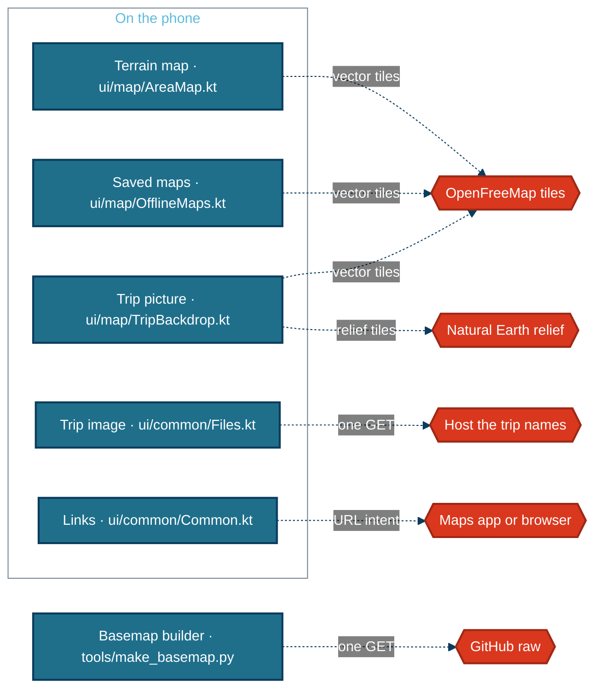

# External services and data sources

Everything the app or the build tools reach off the machine they run on. It was read from the client code, not from the README or the app's Settings page.

## At a glance

Nothing here needs a key or an account, and nothing sends your trip. Importing, planning, booking, exporting and backing up work with no network at all.

## The services

| Service | What is sent | What comes back | Key | When it is down |
|---|---|---|---|---|
| OpenFreeMap vector tiles, `tiles.openfreemap.org/planet` | Tile requests (zoom, x, y) for the area on screen or being saved, with MapLibre's user agent | OpenStreetMap vector tiles, which the app's own style draws | none | The stay map shows plain land with the pins and the scale bar. Tiles already viewed (up to 100 MB) and saved regions still draw |
| Natural Earth relief tiles, on the same host | Tile requests up to zoom 6, only while taking a trip picture | Shaded-relief images | none | The picture is not taken; the trip map draws the offline country outlines instead |
| The trip's own image, at the `tripMap.imageUrl` the file names | One GET to that address, once | An image, kept in `filesDir/images` | none | No image is shown; the map and stay list stand alone |
| Google Maps, Google search, booking and activity links | Nothing from the app: it hands the URL to the phone, which opens the Maps app or a browser | — | none | The other app reports it. Map links say so first when the phone is offline |
| Natural Earth country outlines, from GitHub | One GET at build time, from `tools/make_basemap.py`, cached in `tools/cache` | 1:50m country polygons | none | The script fails; the committed outlines in `app/src/main/assets/basemap/countries.txt` stay as they are |

**The stay maps reach OpenFreeMap whenever they are shown online.** `AreaMap` (`ui/map/AreaMap.kt:116`) has no offline switch: opening a stay's Activities tab with a connection fetches the tiles for that view. Only the saved regions and the 100 MB cache make it work without one.

**A trip picture is taken once per trip, size and set of stays.** `rememberBackdrop` (`ui/map/TripBackdrop.kt:52`) looks for a saved WebP first and calls the snapshotter only when there is none and the phone is online.

**The Settings page says the same.** Its Privacy text names both requests the app makes on its own, map tiles for the area on screen and the trip's overview image, and says no trip details are sent.

**The style never comes from the network.** Every map builds its style from `terrainStyle` (`ui/map/AreaMap.kt:66`) in the app; only tiles are fetched, and no fonts or sprites, because the style draws no text.

## Attribution

| Source | Used for | Terms |
|---|---|---|
| OpenStreetMap, served by OpenFreeMap | Terrain on the stay maps and the trip picture | Open Database License; credit required |
| Natural Earth | Shaded relief in the trip picture; offline country outlines | Public domain |
| MapLibre Native | Drawing and saving the maps | BSD-2-Clause |

The licence asks for visible credit on the map. The stay maps keep MapLibre's ⓘ attribution button (`ui/map/AreaMap.kt:135`), and the trip picture is rendered with attribution on (`ui/map/TripBackdrop.kt:79`). The root README is the landing page; this page carries the attribution in full, and [OVERVIEW.md](./OVERVIEW.md) points here.

*Generated from 72c887b on 2026-10-05.*
