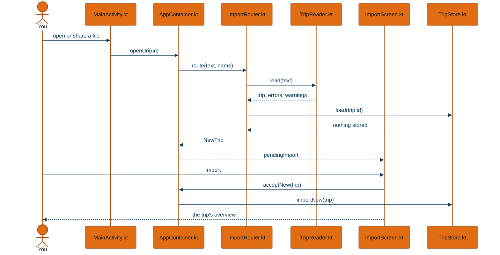
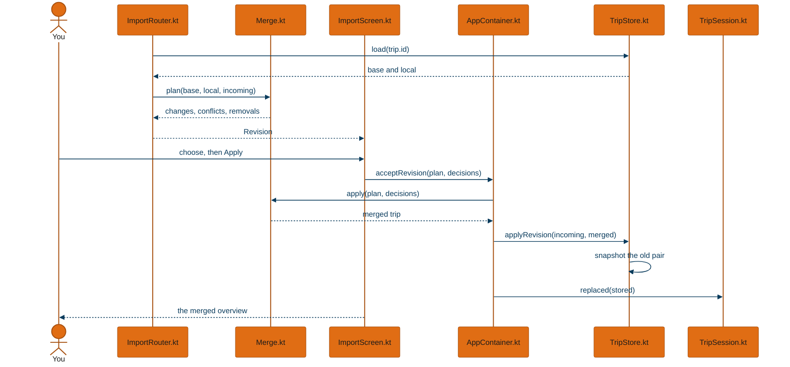
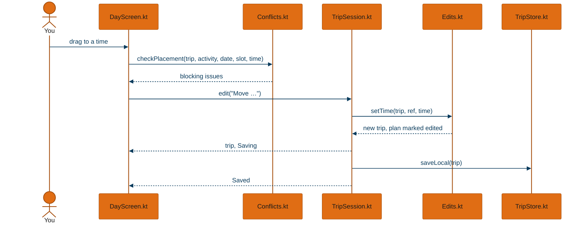
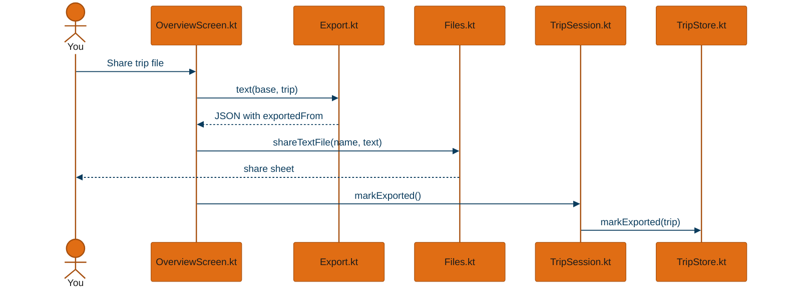
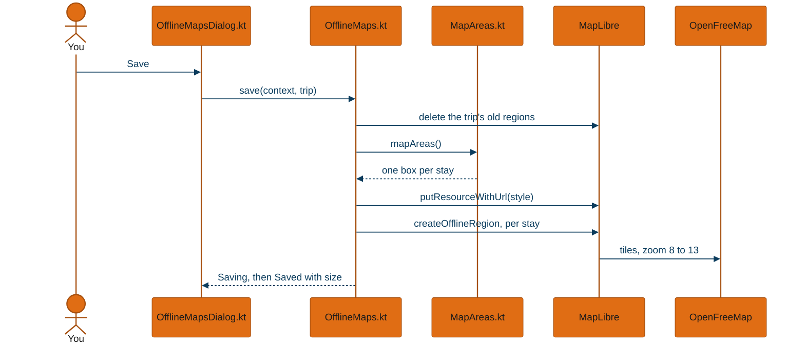
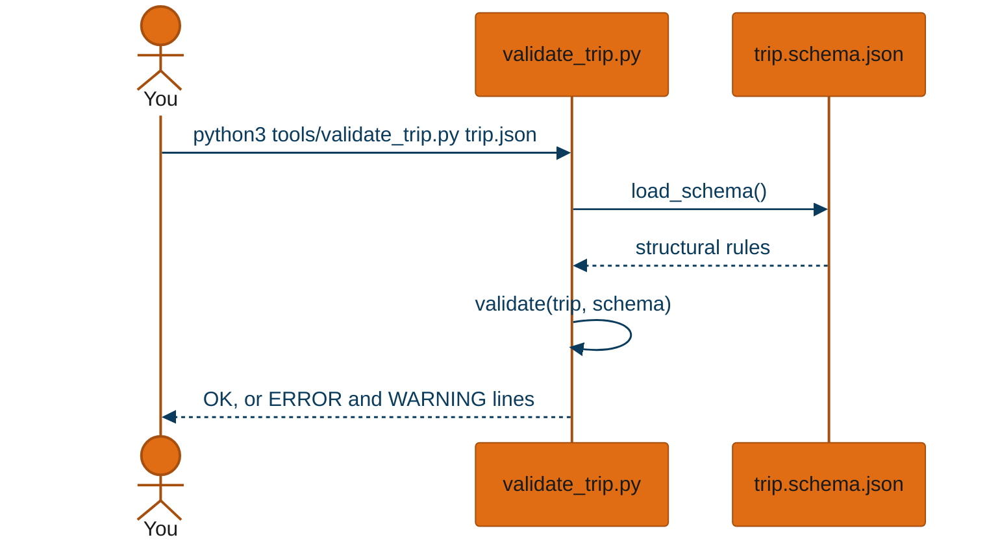

# Workflows

One trace per way into the app that reaches the database or the network, plus the validator, which is the repository's one command-line entry point that people run directly. App paths are relative to `app/src/main/kotlin/dev/tlong/traveler/`.

## Import a new trip

**In plain language:** you open or share a trip file with Traveler. The app reads it, shows a preview with any problems, and saves it only when you tap Import.

- **A file and shared text arrive the same way.** `MainActivity.handle` (`MainActivity.kt:37`) turns a VIEW into `openUri` and a SEND into `openUri` or `openText`; both end in `ImportRouter.route` (`data/ImportRouter.kt:35`).
- **Navigation follows the pending import.** `ui/Nav.kt:56` opens the import screen whenever `pendingImport` is set, from wherever you were.
- **The preview grades the file before you decide.** `TripReader.read` also runs `Completeness.problems` (`model/Completeness.kt`) and `Stamp.check` (`model/Stamp.kt`); the preview shows whether the validator's stamp matches, lists what the assistant should fix, and offers **Copy fix request**. None of it blocks the import.
- **The new trip's two documents start identical.** `TripStore.importNew` (`data/TripStore.kt:53`) writes the normalized trip as both the last import and your plan.

The router's other answers change only what the preview offers: invalid shows the errors, already imported offers to open (or restore) it, a backup offers the trips to restore, and a revision goes to the merge review below.

## Import a revision

**In plain language:** you open the assistant's new version of a trip you already have. The app lists what changed and where you and the file disagree, then merges, keeping a copy of the version before.

- **Same content is not a revision.** Before planning a merge, `data/ImportRouter.kt:48` compares content hashes with the last import and with your plan, and returns already imported instead.
- **The defaults are safe without reading anything.** `Merge.Plan.defaults` (`domain/Merge.kt:57`) keeps yours on every conflict and removes only what the file dropped that you had neither scheduled nor edited.
- **The open screen picks up the result.** `TripSession.replaced` (`data/TripSession.kt:86`) swaps in the new documents and clears undo, so no undo step can cross an import.

## Plan a day

**In plain language:** you hold a block on the day calendar and drag it to a new time. The app checks for clashes, sets the time, and saves at once.

- **A clash asks before it moves.** The day screen checks at `ui/day/DayScreen.kt:252`; a booking, a transfer from 90 minutes before departure, your work blocks, a closed day or opening hours block the drop unless you choose to place it anyway.
- **The edit is recorded as yours.** `Edits.setTime` (`domain/Edits.kt:76`) marks the day's `plan` in `userEdited`, which is what a later merge reads.
- **The screen updates before the write.** `TripSession.set` shows the new plan immediately and queues the write; the Saved mark follows the write.

## Export for a revision

**In plain language:** you send the current plan, edits included, to the assistant to revise.

- **The export keeps the base revision.** `Export.tripFile` (`domain/Export.kt:18`) leaves `revision` at the last import and adds `exportedFrom` with the number of local changes; the assistant raises the revision.
- **The file name says whether you edited.** `Export.fileName` (`domain/Export.kt:31`) adds `-edited` when there are local changes.
- **"Unexported changes" is a hash comparison.** The overview compares the plan's hash with the one saved at the last export (`ui/overview/OverviewScreen.kt:181`).

Save trip file and Copy JSON in the same menu differ only in where the text goes.

## Save maps for offline

**In plain language:** from the trip menu you save the terrain around each stay, so the stay maps work with no signal.

- **Each stay's box is its places plus 2 km.** `Trip.mapAreas` (`domain/MapAreas.kt:10`) covers the stay, its lodging and its activities with coordinates.
- **The style is planted before the download.** MapLibre's downloader fetches only over HTTP, so `ui/map/OfflineMaps.kt:67` stores the style under a placeholder address it then finds locally.
- **Regions are tagged with the trip.** Each region's metadata is `tripId/stayId` (`ui/map/OfflineMaps.kt:74`), which is how remove and the start-up prune find them.

## Validate a trip file

**In plain language:** before importing, you or the assistant can check a file on a computer and get the same errors and warnings the app's preview shows.

- **One schema, two readers.** `load_schema` (`tools/validate_trip.py:30`) reads the schema beside the script or from `schema/`; the cross-checks JSON Schema cannot express (ids exist, dates line up, real time zones) are written in both this script and `model/TripReader.kt`.
- **The two are tested on the same files.** `tools/test_validate_trip.py` and the app's `TripReaderTest` both run every file in `schema/examples` and `schema/invalid`.
- **`--complete` is stricter.** It also requires stars, prices, priorities and booking details, which the demo trip must pass.

## Not traced

| Workflow | Where | Why not traced |
|---|---|---|
| Back up all trips, and restore | `ui/settings/SettingsScreen.kt`, `data/TripStore.kt` | One store call each way; the restore preview is the import trace with a backup answer |
| Restore an earlier version | `ui/history/HistoryScreen.kt` | One store call, which snapshots then overwrites, as in the revision trace |
| Mark something booked | `ui/bookings/BookingsScreen.kt` | The plan-a-day shape with `Edits.markBooked` in place of `setPlan` |
| Delete, undelete, archive | `ui/trips/TripsScreen.kt` | Single column updates |
| Copy instructions, load the demo trip | `ui/settings/SettingsScreen.kt` | Read an asset; the demo then follows the import trace |
| Open in Google Maps, search, booking links | `domain/MapsLinks.kt`, `ui/common/Common.kt` | Hand a URL to the phone; nothing is stored |
| Build the skill, regenerate fixtures or basemap | `tools/` | Developer scripts with no runtime path; their steps are in the overview's container table |

*Generated from 72c887b on 2026-10-05.*
